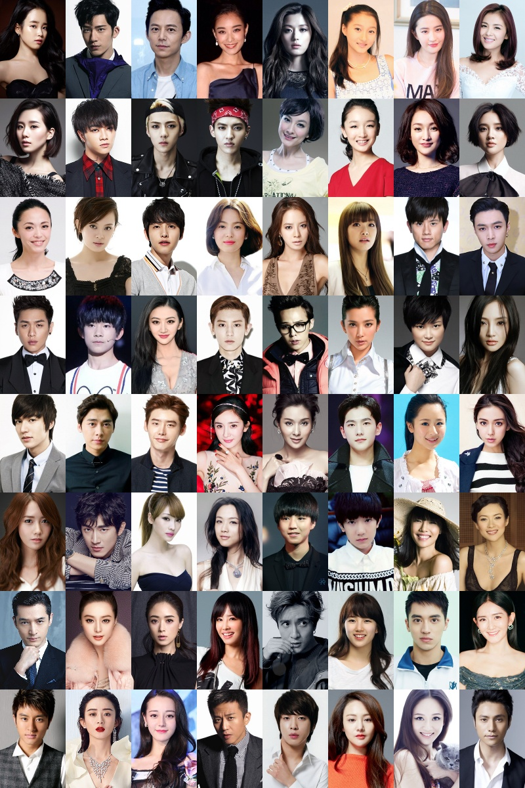

# StarFace-python

基于arcface与MTCNN实现的明星脸相似度分析，用于寻找与你最相似的明星

## Dependence

* opencv
* pytorch
* tqdm

## Usage

1. run `python starnet.py` to download star pictures using crawler. My download is [here](https://pan.baidu.com/s/1PsyzeuNuMapmf7FwYqZ_Rg).

2. run `python get_facebank.py` to generate facebank pickle file.

3. run `python main.py --img <img_path>` to find your most similar star face. Here is some result

   

   

   

## Reference

[mtcnn](https://github.com/TropComplique/mtcnn-pytorch)

[insightface](https://github.com/TreB1eN/InsightFace_Pytorch)